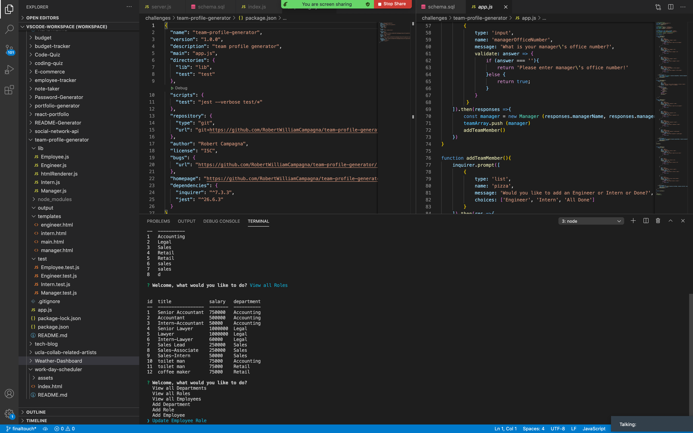

# Employee Tracker

## Description 
A inquierer based application used to add, update, delete, Employee Roles and Employee information.

## Installation
run npm install inquirer from the root directory of the project.
## Usage

## Contact
[Github](https://github.com/RobertWilliamCampagna)

email: rwcnyla@gmail.com
